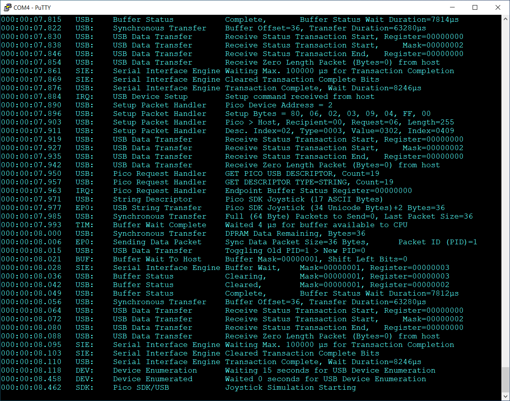

# Raspberry Pico Native SDK-based Device USB stack

#### Proof-of-Concept development to help understand USB device stack operation in a Pico SDK/Hardware context.

This repository has one main objective, which is to investigate USB Device stack development using native SDK functions only.

The 'stack' [^1] is written in C, and is derived from the [low-level device example](https://github.com/raspberrypi/pico-examples/tree/master/usb/device/dev_lowlevel) supported by the Raspberry Pico documentation set.

Extensive debug/log reporting via UART0 has been provided in lieu of an external hardware USB protocol analyser.

Synchronous (blocking) and Asynchronous (interrupt-driven) transmission functions are provided. 

Multipacket transfers are currently supported in Pico-to-Host direction only.

This release uses endpoint_0 max packet size = 8 to better illustrate PID toggling.

No attempt to optimise memory usage, code size, style or performance has been made at this stage.

The repository may be extensively modified or made unavailable at any time without notice.

Some unresolved issues (possibly related to stack usage ?) remain in the endpoint handler and debug routines.

### Usage

The example provided simulates a continually-running joystick.

Once compiled, the uf2 image can be uploaded as normal and the Pico attached to a host machine.

It should then enumerate as a Human Interface Device / Joystick game controller and send continual activity to the host.

Windows Game Controllers
  

#### Windows Game Controllers

   
On a Windows machine, type joy.cpl into the search box to display the game controller properties.

The properties windows should update continually at a nominal rate of 3Hz.

#### Pico pre-built .uf2

Pico Binary

Pre-Built .uf2 [available here](https://github.com/Serialcomms/Raspberry-Pico-SDK-USB/releases/tag/Pico_HID_Joystick)

Pico Debug Output
  

#### Pico Debug Output

### Testing

Testing has been performed with a Windows 10 22H2 Host and a Pico Chip B2, ROM V3 device only.

Acknowledgements
  

* [Microsoft USB Device Enumeration](https://techcommunity.microsoft.com/t5/microsoft-usb-blog/how-does-usb-stack-enumerate-a-device/ba-p/270685)
* [Microsoft USB Control Transfer](https://learn.microsoft.com/en-us/windows-hardware/drivers/usbcon/usb-control-transfer)
* [USB Descriptor and Request Parser](https://eleccelerator.com/usbdescreqparser/)
* [Thesycon USB Descriptor Dumper](https://www.thesycon.de/eng/usb_descriptordumper.shtml)
* [BUSDOG USB Analyser](https://github.com/djpnewton/busdog)
* [phind.com](https://phind.com)

Raspberry Pico Forums Association
 

This repository is currently associated with the following Raspberry Pico forum thread :-

* [Raspberry Pico forums thread](https://forums.raspberrypi.com/viewtopic.php?t=363705)

[^1]: The 'stack' is more of a 'controller' at this stage of development.
There are no published APIs or documentation available.
